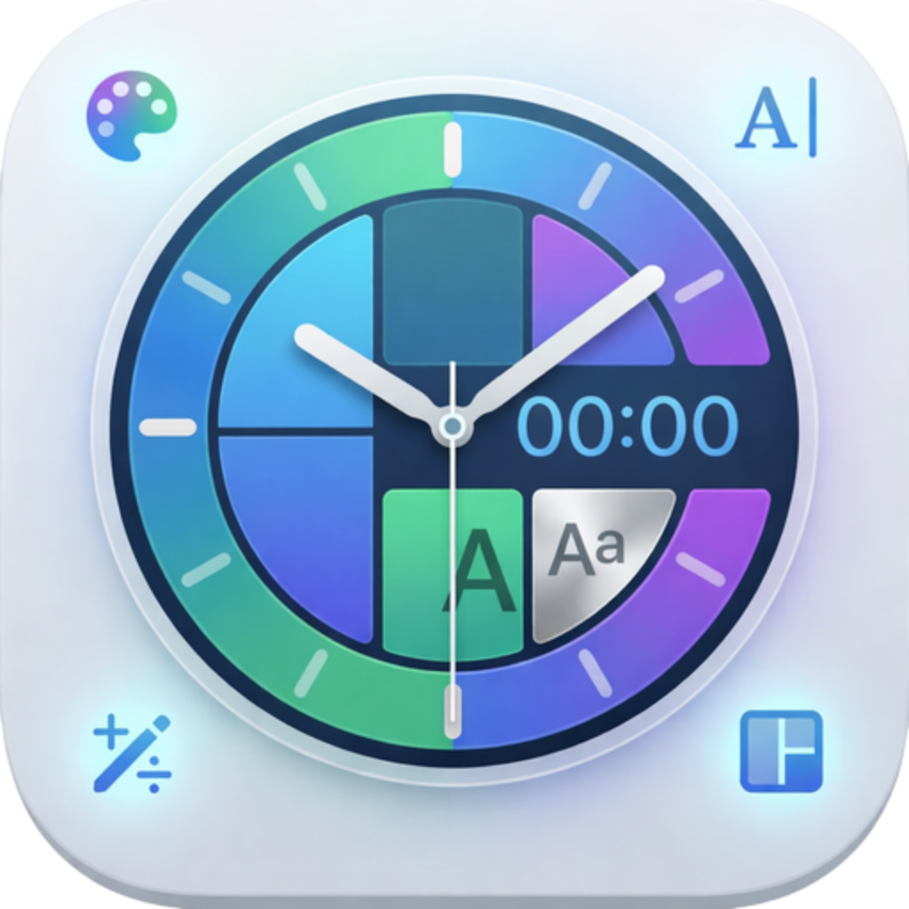
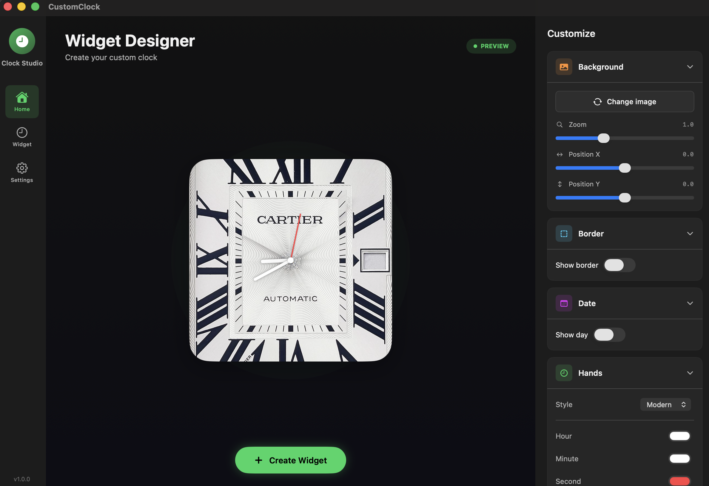
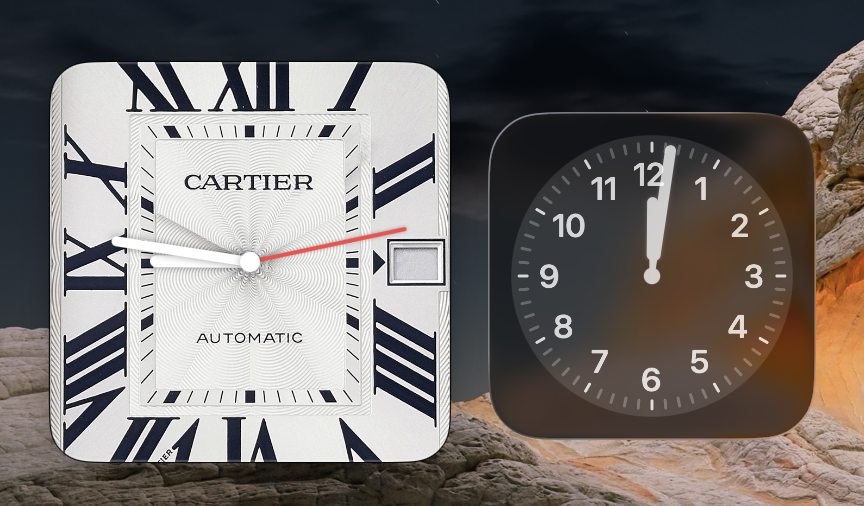

<table>
  <tr>
    <td></td>
    <td><h1>CustomClock</h1></td>
  </tr>
</table>

A customizable macOS clock widget application. Design and personalize desktop clock widgets with custom backgrounds, colors, and styles.

**Homepage**



**Widget**



> Preview images are illustrative and sourced from https://it.pinterest.com/pin/2322237302437200/

## Features

- **Custom Backgrounds** — Add and position background images with fine-tuned scale and offset controls
- **Styled Hands** — Choose colors for hour, minute, and second hands; select from multiple hand styles
- **Border Options** — Customize border color and width, or disable completely
- **Day Number Display** — O All customizations are automatically saved

## Requirements

- macOS 12.0 or later

## Installation

### Quick Start

Download and run the app directly:

```bash
open CustomClock.app
```

Or clone the repository and run it:

```bash
git clone https://github.com/yourusername/CustomClock.git
cd CustomClock
open CustomClock.app
```

### Build from Source

If you want to modify or build the app yourself:

1. Clone the repository
   ```bash
   git clone https://github.com/yourusername/CustomClock.git
   cd CustomClock
   ```

2. Open the project in Xcode
   ```bash
   open CustomClock.xcodeproj
   ```

3. Press `Cmd + R` to build and run

##    ```bash
   open CustomClock.xcodeproj
   ```
Usage

The app has three main sections in the sidebar:

**Home** — Overview and quick access

**Widget** — Create and manage your clock widgets. Customize appearance, colors, and layout.


## Design

Built with SwiftUI and a clean dark theme. The accent color is a vibrant green that stands out against the carefully chosen grayscale palette.

## 👤 Author
Design

Built with SwiftUI and a clean dark theme. The accent color is a vibrant green that stands out against the carefully chosen grayscale palette.
---

**VLicense

MIT